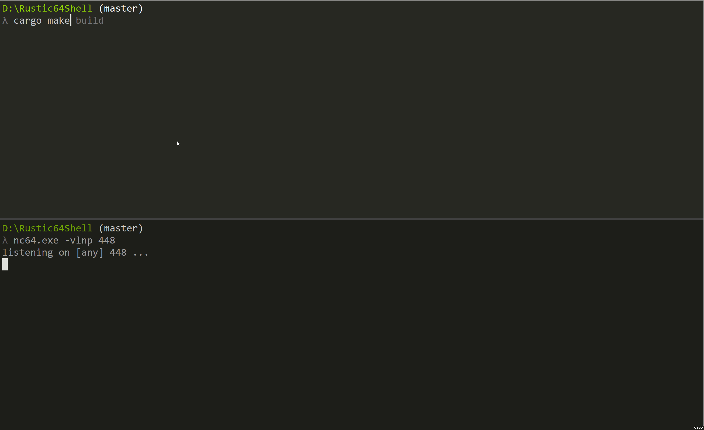

# Rustic64Shell

**Rustic64Shell** is a modern 64-bit position-independent implant, based on [Rustic64](https://github.com/safedv/Rustic64). While **Rustic64** was designed as a template, **Rustic64Shell** was built to take things a step further. This project introduces advanced features like indirect syscalls and reverse shell, demonstrating how the template can be expanded for more complex scenarios.

This is a personal project with the goal of improving my skills in modern implant development. I see this project as an ongoing journey, and any feedback, improvements, or suggestions from the community are more than welcome—seriously, help me make this better!

## Key Features

**Rustic64Shell** steps things up with some cool extras beyond what **Rustic64** offered:

- **Reverse shell**: Open a reverse shell and execute commands remotely via `cmd.exe` or `powershell.exe`, using **Winsock** for network communication and **pipe-based I/O redirection (via NT APIs)**.

- **Indirect Syscalls**: It supports indirect syscalls, letting the implant execute syscalls without calling them directly. Techniques like **Hell's Gate**, **Halo's Gate**, and **Tartarus' Gate** are employed to retrieve System Service Numbers (SSNs).

## Reverse Shell

**Rustic64Shell** brings reverse shell support, using Winsock for network communication and Windows pipes for I/O redirection. The reverse shell sets up a TCP connection to a remote server and launches a process like `cmd.exe` or `powershell.exe` on the target system. The process's I/O is redirected through pipes, giving you full remote control. Here are its key features:

- **Socket-based connection**: Sets up a TCP connection to a remote server using Winsock.
- **Non-blocking mode**: Operates the socket in non-blocking mode for efficient, asynchronous communication.
- **Pipe-based I/O redirection**: Redirects the process’s input (stdin) and output (stdout/stderr) through pipes, using NT APIs like `NtCreateNamedPipe`, `NtReadFile`, and `NtWriteFile`.
- **Process creation**: Starts a hidden process (such as `cmd.exe` or `powershell.exe`) with `CreateProcessW`.

## PoC

## Disclaimer

This project is intended **for educational and research purposes only**. It’s here to show a modern approach to implant design using Rust and should _definitely_ not be used for any illegal or unethical activities. What’s provided here is a proof of concept, and if you decide to misuse it, that’s on you—not me!

Always follow ethical guidelines and legal frameworks when doing security research (and, you know, just in general).

## Contributions

Contributions are welcome! Want to add features, report bugs, or improve the docs? Feel free to open a pull request or an issue. I’m all ears for suggestions on how to make **Rustic64Shell** even better!

---
